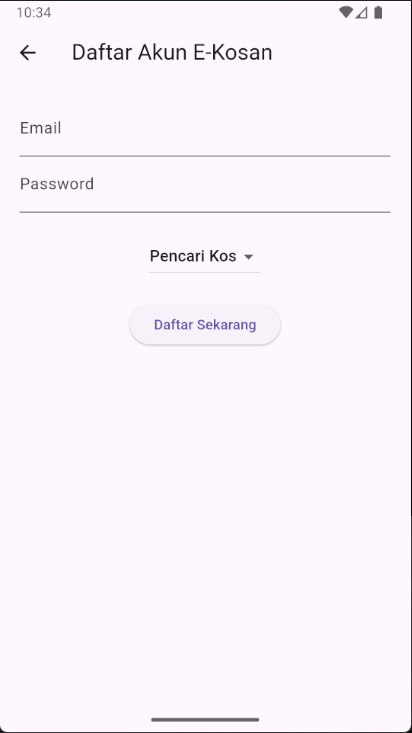
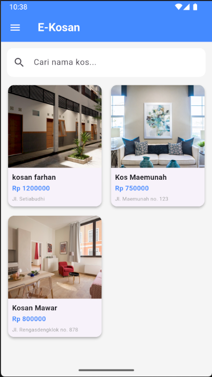
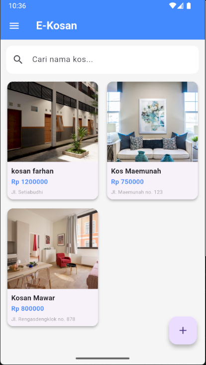
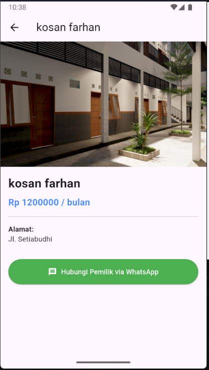
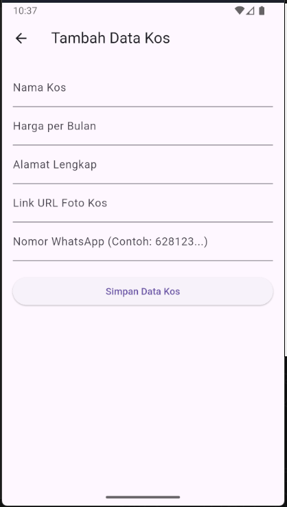
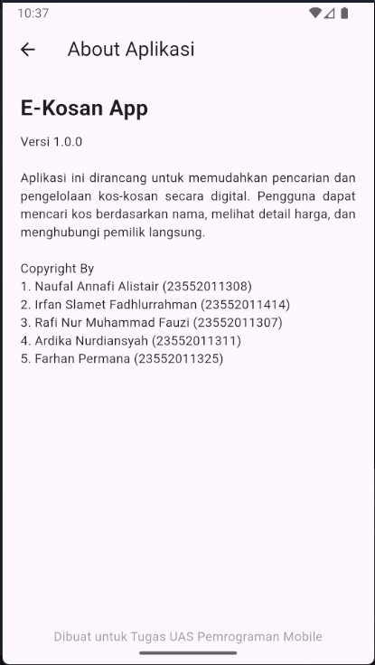

# 🏠 Ekosan – Aplikasi Mobile Pencarian & Pengelolaan Kos

Ekosan adalah aplikasi mobile berbasis **Flutter**, aplikasi ini bertujuan untuk mempermudah proses **pencarian kos bagi pencari kos** serta **pengelolaan data kos bagi pemilik kos** dalam satu platform yang terintegrasi.

---

## 📱 Fitur Utama

### 🔍 Fitur Pencari Kos
- Mencari kos berdasarkan nama
- Melihat detail kos
- Melihat foto kos
- Menghubungi pemilik kos via Whatsapp

### 🏘️ Fitur Pemilik Kos
- Menambahkan data kos
- Mengelola informasi kos
- Mengunggah foto kos
- Mengedit dan menghapus data kos

---

## 🛠️ Teknologi yang Digunakan
- **Flutter** (Framework)
- **Dart** (Bahasa Pemrograman)
- **Firebase** (Database)

---

## 📸 Screenshot Aplikasi

  
  
  

  
  
  

  
  

---

## 🎥 Video Demo Aplikasi

https://github.com/user-attachments/assets/4c161947-8896-4e4a-8477-a59973befa42

> Video berisi penjelasan alur penggunaan aplikasi.

---

## 👥 Tim Pengembang
Proyek ini dikembangkan oleh Kelompok 5.

- Naufal Annafi Alistair (23552011308)
- Irfan Slamet Fadhlurrahman (23552011414) 
- Rafi Nur Muhammad Fauzi (23552011307) 
- Ardika Nurdiansyah (23552011311)  
- Farhan Permana (23552011325)  
